# hackintool-z490i-unify-opencore
黑苹果配置文件分享

# 配置
 - 主板：微星z490i-unify
 - cpu：i5-10600k
 - 网卡：bcm94352z
 - 内存：海盗船 DDR4 3200 16Gx2
 - 硬盘：西数 sn750 500G

# 已实现的驱动
 声卡、网卡、显卡已完美驱动
 - 睡眠 √ （使用雷电口作为视频输出时，唤醒需按开机键或其它usb口设备）
 - 隔空投送 √
 - 接力 √
 - 跨设备粘贴 √
 - 蓝牙 √
 - USB定制 √ （内置typec未定制，因为我的机箱没有）
 - 2.5G有线网卡 √
 - DP 视频输出 √
 - HDMI 视频输出 √ （4k显示器仅支持30hz）
 - 三方显示器亮度调节 √（[MonitorControl](https://github.com/MonitorControl/MonitorControl/releases/)）
 - 核显显存（4G）√
 - 声卡 √
 - 自动睿频 √
 - 雷电3 √（支持视频输出、热插拔、usb等，`无雷电设备，未测试具体雷电扩展功能`，但除雷电扩展外，仅用视频输出+dock正常使用已经无碍）

# BIOS 设置
 - xmp 启用
 - cpu-自动超频 启用
 - cfg-lock 关闭
 - 核显多显示器输出 开启
 - usb唤醒s3，s4，s5 启用 （启用它才能支持usb设备唤醒睡眠）

# 雷电接口实现前提
 - 主板固件需更新([下载](https://cn.msi.com/Motherboard/MEG-Z490I-UNIFY/support))到最新版本，我使用的是 `2022-06-21的7C77v1C` 版本，更新过程简单可查看官网教程
 - BIOS 中雷电选项中，将所有选项开启
 - ACPI 中包含 `SSDT-TB3HP.aml`

# bios-截图

# 其它截图
 - kext
   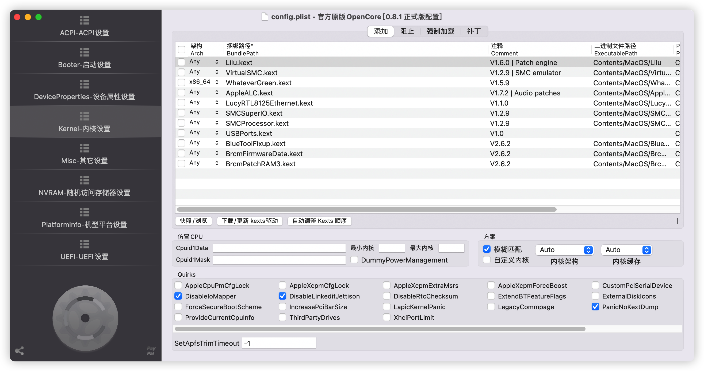
   博通bcm94352z 需要 `BlueToolFixup.kext、BrcmEirmwareData.kext、BrcmPatchRAM3.kext` 驱动辅助
   
   如果换成`BCM94360CD`则不需要这些驱动，直接免驱
 - 核显设置
   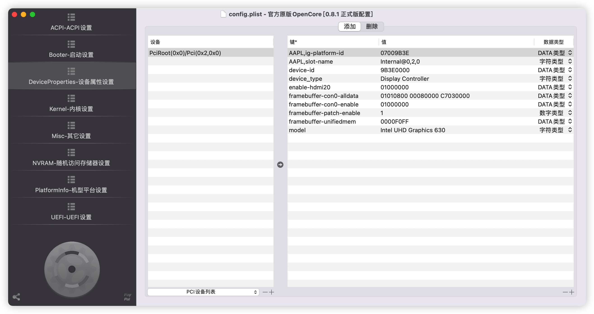
   - `framebuffer-conO-alldata` 启用hdmi端口
   - `framebuffer-unifiedmem` 分配给核显的显存：0000FOFF=4G，000000C0=3G，00000080=2G，自行根据内存大小来分配，我这里设置4G
 - 显卡-显存
   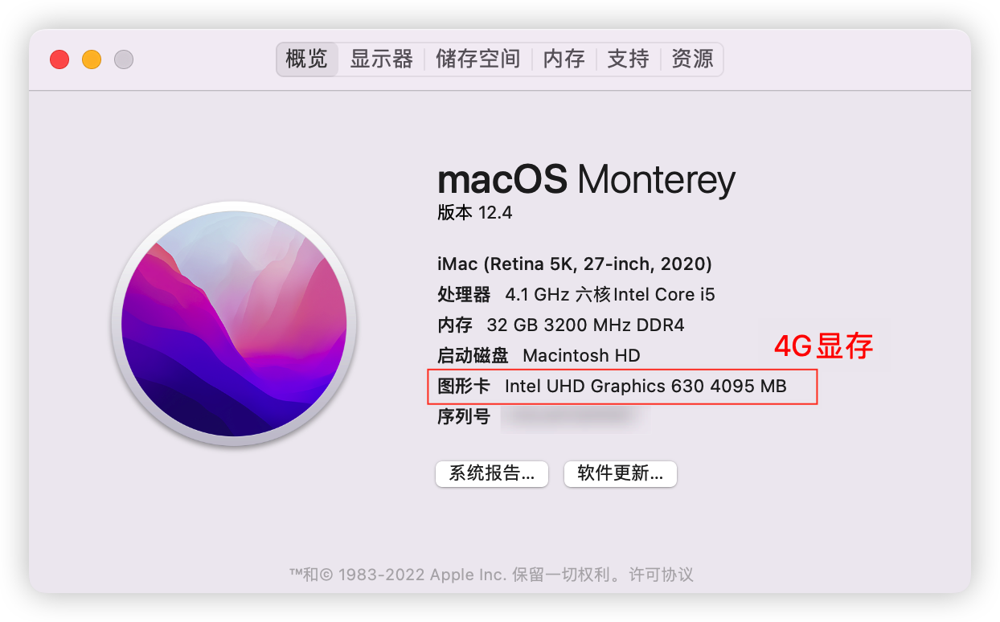
 - smbios 自行设置
   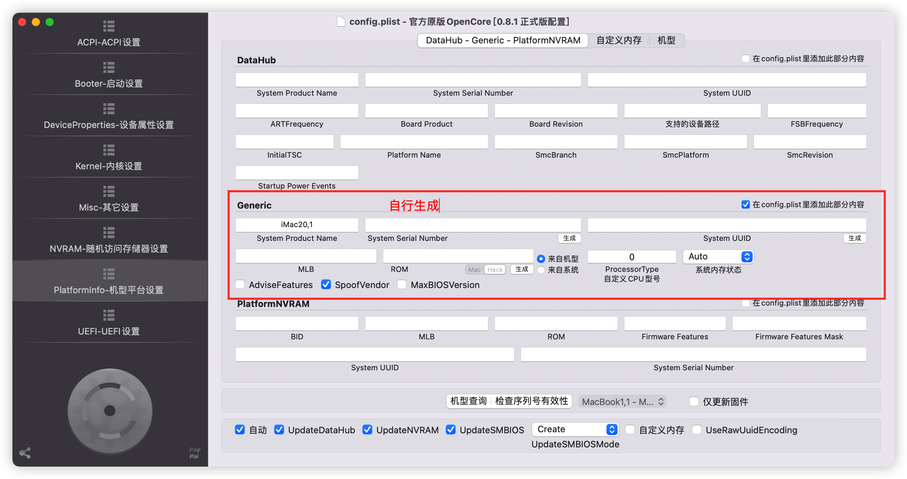
 - uefi插件，支持图形化
   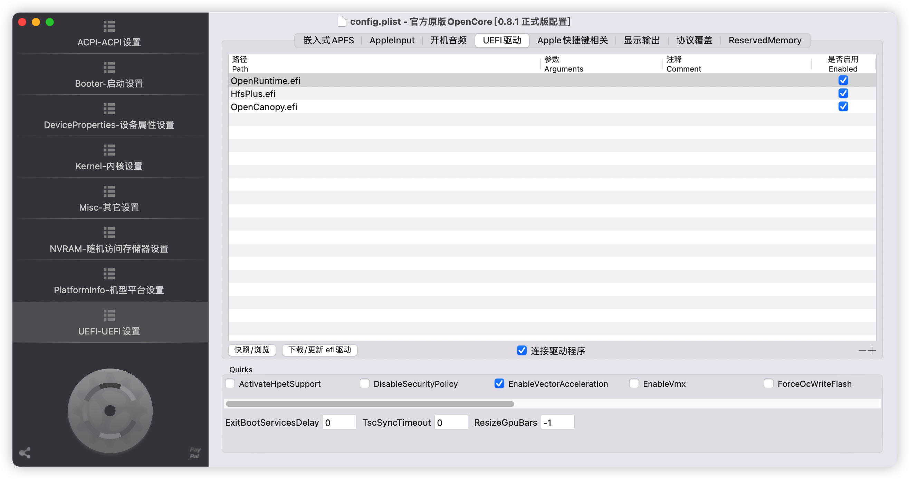
 - usb定制
   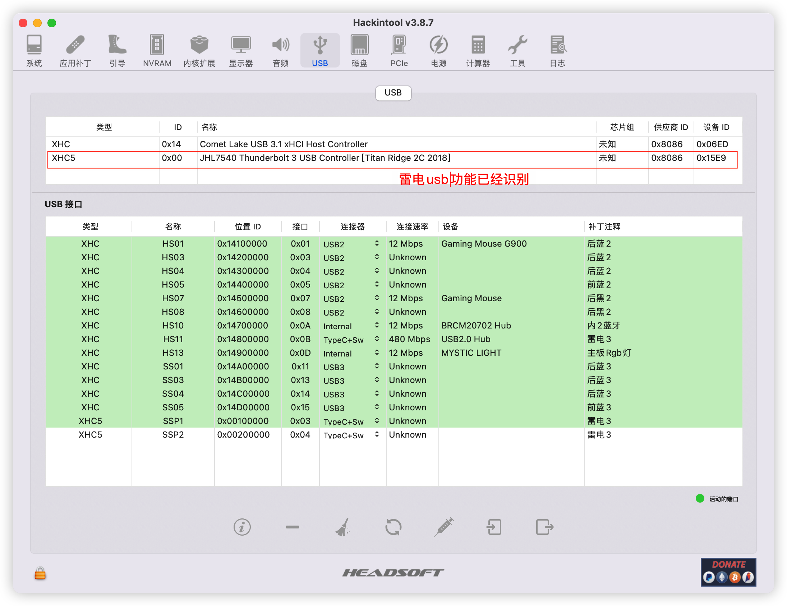
 - 雷电卡，视频输出功能
   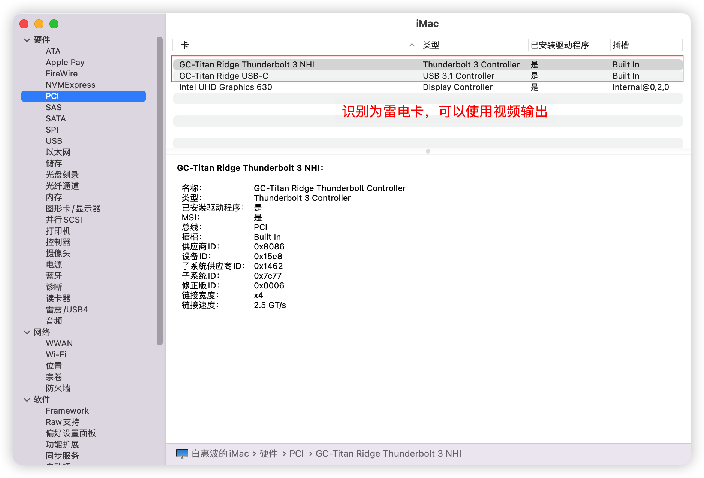
 - 雷电树-没有
   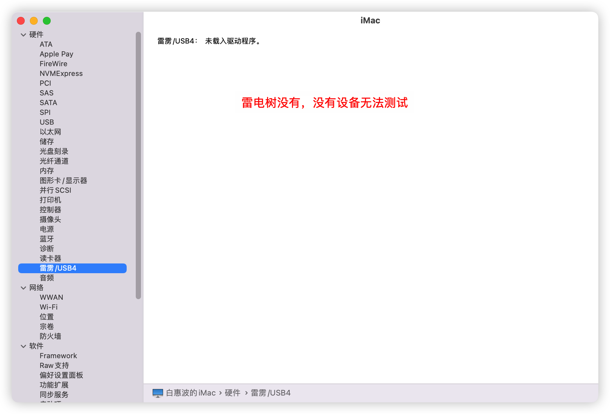
 - 显示器
   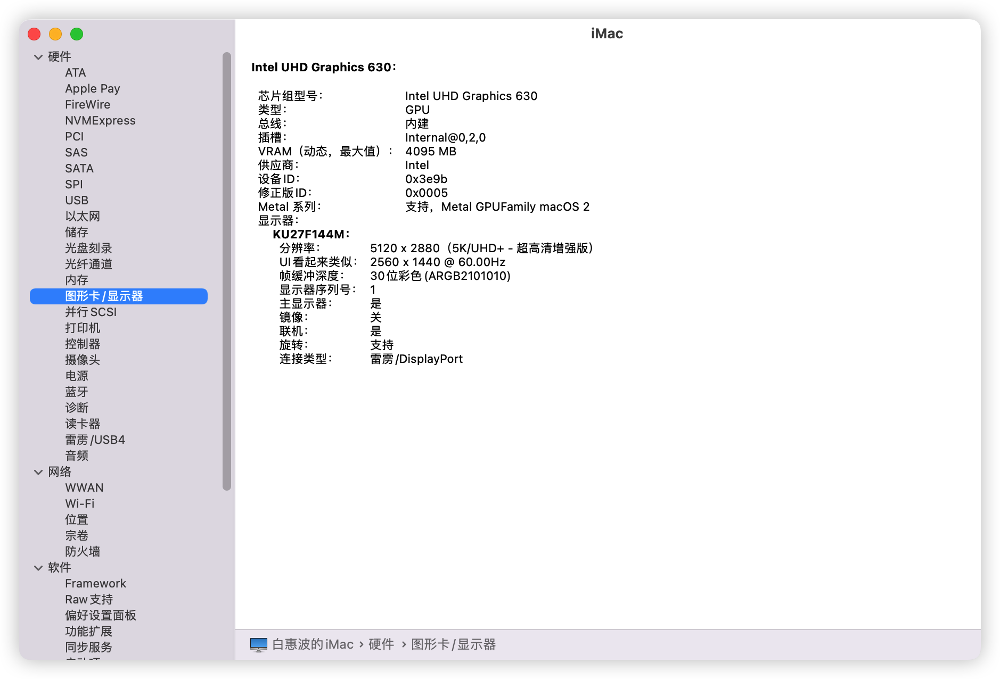
 - 有线网
   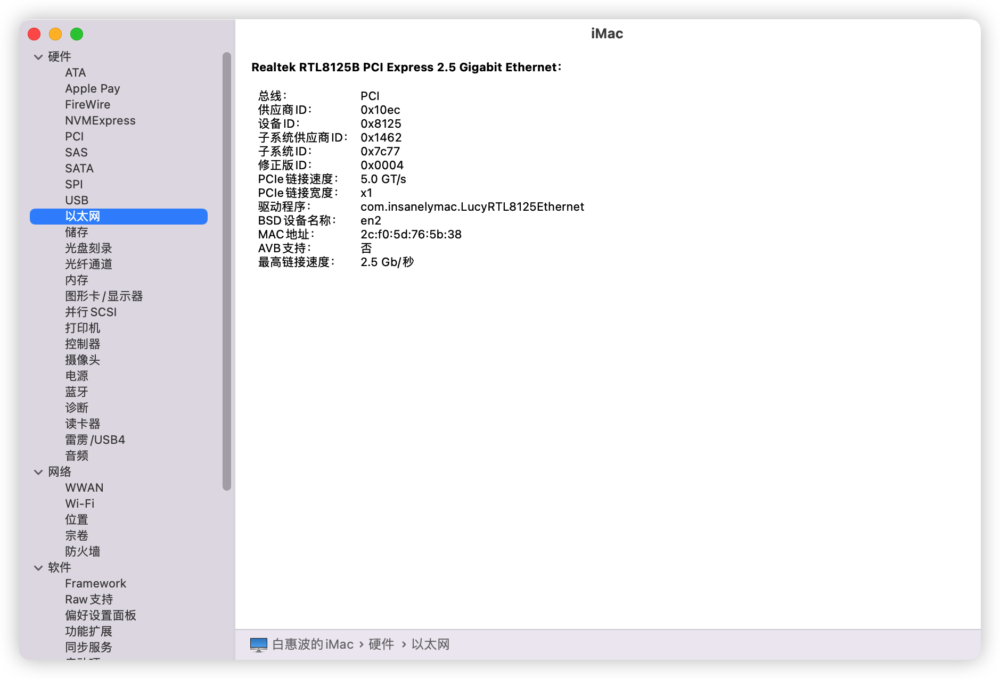
 - wifi
   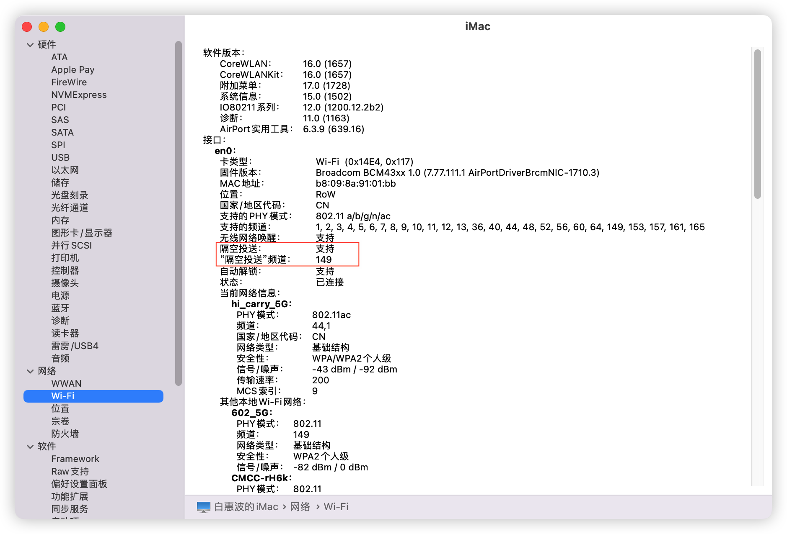
 - 杂项
   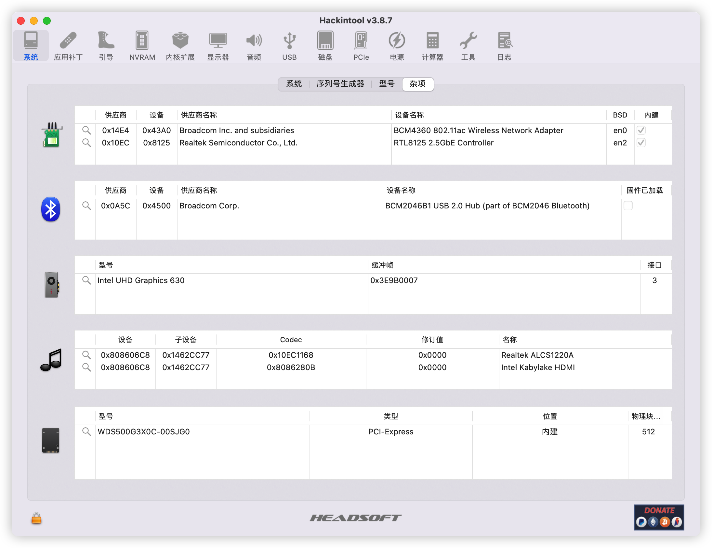
  
